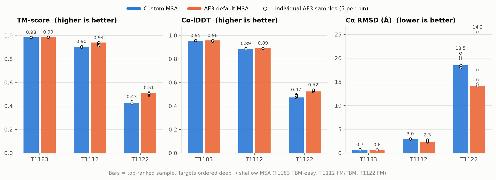
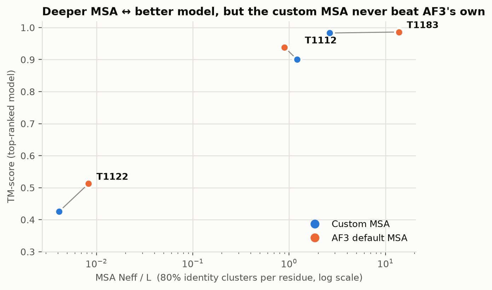
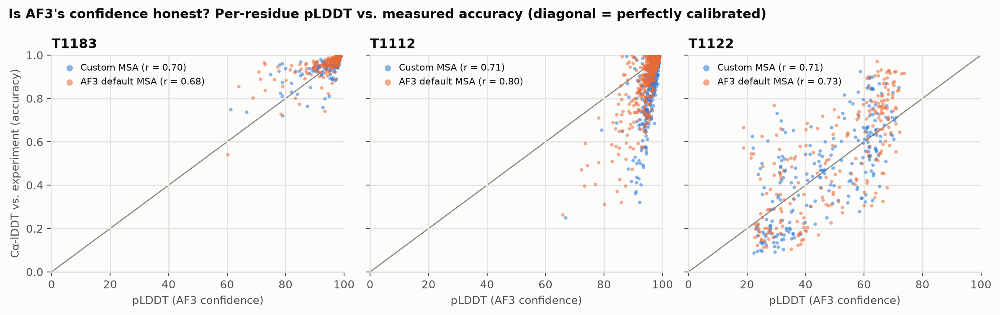

# Results: custom MSA vs. AlphaFold3 default MSA

All numbers below are generated by `scripts/write_results.py` from `eval/*.csv`. Accuracy is measured against the experimental structure within the CASP15 evaluation unit: TM-score and Cα RMSD from US-align (residue-index superposition, TM normalized by reference length), and superposition-free Cα-lDDT. Each AF3 job returns 5 samples; the table reports the top-ranked one, and the 5-sample mean ± sd shows how much of a difference is noise.

## Summary

| Target | CASP class | MSA Neff/L custom / AF3 | TM custom | TM default | ΔTM | Cα-lDDT custom / default | RMSD custom / default (Å) | pLDDT custom / default |
|---|---|---|---|---|---|---|---|---|
| T1183 (8IFX) | TBM-easy | 2.632 / 13.776 | 0.983 (0.983±0.001) | 0.986 (0.984±0.001) | **-0.003** | 0.954 / 0.956 | 0.70 / 0.63 | 93.7 / 92.6 |
| T1112 (8ORK) | FM/TBM | 1.206 / 0.895 | 0.901 (0.902±0.003) | 0.938 (0.925±0.010) | **-0.038** | 0.887 / 0.892 | 3.00 / 2.28 | 96.4 / 94.9 |
| T1122 (8BBT) | FM | 0.004 / 0.008 | 0.425 (0.427±0.006) | 0.513 (0.503±0.009) | **-0.087** | 0.473 / 0.523 | 18.47 / 14.17 | 46.2 / 49.0 |

TM values: top-ranked sample (5-sample mean ± sd). ΔTM = custom − default. AF3 Neff/L counts the unpaired + paired MSAs the server used.

## Per target

### T1183 — PDB 8IFX, TBM-easy, evaluation unit 1-195

- Verdict: **no meaningful difference** (ΔTM = -0.003, within sample-to-sample noise).
- MSA: custom 581 sequences (Neff/L 2.632) vs. AF3 8032 sequences (Neff/L 13.776).
- Templates AF3 picked: custom run 1okj, 3r6m, 3zet, 4wq4; default run 1okj, 3r6m, 3zet, 4wq4 (identical).
- Figures: [per-residue](figures/T1183/per_residue.png) · [PAE](figures/T1183/pae.png) · [overlay](figures/T1183/overlay.png) · [pLDDT overlay](figures/T1183/overlay_plddt.png)

A TBM-easy target with a deep MSA either way. Both conditions reach TM ≈ 0.98 and Cα RMSD < 1 Å, the same templates were used, and the two predictions are nearly indistinguishable. AF3's own MSA is about 5× deeper in Neff/L (13.8 vs 2.63), but accuracy is already saturated, so the extra depth buys nothing.

### T1112 — PDB 8ORK, FM/TBM, evaluation unit 1-460

- Verdict: **AF3 default MSA more accurate** (ΔTM = -0.038; all 5 samples of one condition beat all 5 of the other).
- MSA: custom 855 sequences (Neff/L 1.206) vs. AF3 1967 sequences (Neff/L 0.895).
- Templates AF3 picked: custom run 1vl8, 2hf8, 2wsm; default run 2hf8, 2wsm, 3dm5, 4lps (**different**, consistent with AF3's template search being driven by the input MSA).
- Figures: [per-residue](figures/T1112/per_residue.png) · [PAE](figures/T1112/pae.png) · [overlay](figures/T1112/overlay.png) · [pLDDT overlay](figures/T1112/overlay_plddt.png)

The clearest MSA effect. Our filtered custom MSA actually has the *higher* Neff/L (1.21 vs 0.90), because the coverage ≥ 50% / identity ≥ 20% filter keeps fewer but more diverse full-length hits. AF3's MSA keeps partial-coverage fragments too, so roughly 1.7× more sequences cover each column. The default model has equal or better lDDT at ~76% of residues, and the gap is concentrated in the C-terminal region (≈ residues 340–425), where the custom model's Cα error reaches ~12 Å (88% vs 76% of residues within 3 Å overall). That region is folded correctly *locally* in both models; the custom model places it at the wrong angle relative to the core (6.2 vs 4.3 Å after superposing residues 1–339). Domain orientation depends on co-evolution from full-length homologs, which the coverage filter thinned out. Templates cover only ~35% of the chain in either run and the models do not follow them (see METHODS.md §4). Notably, the custom model has the *higher* mean pLDDT (96.4 vs 94.9) while being less accurate.

### T1122 — PDB 8BBT, FM, evaluation unit 4-237

- Verdict: **AF3 default MSA more accurate** (ΔTM = -0.087; all 5 samples of one condition beat all 5 of the other).
- MSA: custom 2 sequences (Neff/L 0.004) vs. AF3 3 sequences (Neff/L 0.008).
- Templates AF3 picked: custom run 2pyb, 3f9i, 4ayd; default run 2pyb, 3f9i, 4oyu (**different**, consistent with AF3's template search being driven by the input MSA).
- Figures: [per-residue](figures/T1122/per_residue.png) · [PAE](figures/T1122/pae.png) · [overlay](figures/T1122/overlay.png) · [pLDDT overlay](figures/T1122/overlay_plddt.png)

The hard, FM target, and the one the working hypothesis expected a custom MSA to help. In practice neither pipeline found any homolog. Our custom MSA is the query plus one UniRef100 entry that *is* the query (100% identity). AF3's MSA is the same self-hit plus one 37-residue fragment of a bacterial protein (35% identity, covering residues ~19–55). Both are effectively single-sequence (Neff/L < 0.01). Both models place three helical segments within 3 Å (≈ residues 60–82, 118–135 and 192–225) and misplace the rest; 40% vs 32% of residues are within 3 Å for default vs custom. The default run is modestly but consistently better (no overlap across the 5 samples). Since the MSAs carry no evolutionary information in either condition, this gap cannot come from MSA *content*. The templates do not explain it either: all are poor (TM ≤ 0.11 against the experiment) and neither model follows them. The most likely explanation is run-to-run (seed) variation, which one job per condition cannot measure (METHODS.md §4).

## Overall conclusion

Across the 3 targets the custom MSA improved TM-score on 0, made it worse on 2, and made no meaningful difference on 1 (mean ΔTM = -0.043).

The working hypothesis was that a hand-built MSA would help most on shallow, hard targets. These data do not support it. AF3's server MSA was at least as good on all three targets. Target difficulty and MSA depth still order the results as expected: accuracy falls from T1183 (TM ≈ 0.98) to T1112 (≈ 0.9) to T1122 (≈ 0.5). But the custom-vs-default difference does not grow on the shallow target in a way that favours the custom MSA. The practical reason is that a custom MSA can only help when it finds homologs the default pipeline missed. Our ColabFold/MMseqs2 search (UniRef + environmental DB) found fewer sequences than AF3's own search (its MSA headers show UniRef90, MGnify and UniProt hits) on both deep targets, and found nothing more on the orphan target. Our filter also dropped partial-coverage hits that AF3 keeps, which is the likely cause of the T1112 C-terminal regression: our raw search had more T1112 sequences than AF3 (2,547 vs 1,967) before the filter removed 58% of them, and the custom model loses the C-terminal domain orientation. Uploading a custom MSA also changes which templates AF3 retrieves, but a template-by-template check shows templates do not explain the gap on any target. Settings and evidence: METHODS.md.

## Is AF3's confidence a usable proxy?

Per-residue pLDDT tracks measured Cα-lDDT reasonably well (r ≈ 0.7–0.8 across targets and conditions), and mean pLDDT ranks the three *targets* correctly. It does **not** rank the two *conditions* correctly. On T1183 and T1112 the custom run has the higher mean pLDDT (93.7 vs 92.6; 96.4 vs 94.9) yet the lower TM-score. The same holds for pTM/ranking_score. So choosing between MSA strategies by AF3 confidence alone would have picked the worse model on T1112. A reference structure (or a held-out benchmark) is needed to make that call.

## Limitations

- **n = 3 targets.** This is a case study, not a statistical test; the per-target sample spread is reported so single-sample noise is not over-read.
- **One seed per condition.** The AF3 server chose a different random seed for each job (see `af3_*/*/job_metadata.json`). The 5 diffusion samples within a job share that seed's trunk, so the ± sd understates seed-to-seed variance.
- **Templates were on in both conditions** and were re-searched per job, so they differ for T1112 and T1122. `scripts/analyze_templates.py` finds they don't explain the gap (weak, and not followed by the models), but a templates-off rerun would remove the question entirely.
- **Custom MSA replaces, not augments,** AF3's MSA on the server. A 'union of both MSAs' condition was not tested.
- **Cα-lDDT**, not the all-atom lDDT CASP reports; TM-score/RMSD are also Cα-based. Rankings between conditions agree across all three metrics here.
- The AF3 server's exact submission time and model build are not in its download; `submitted_at` is left null and `finished_at` is taken from the zip timestamps.
